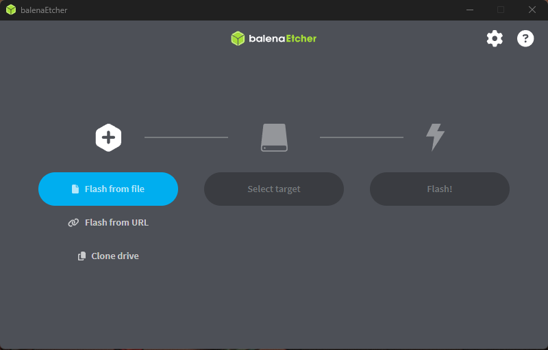
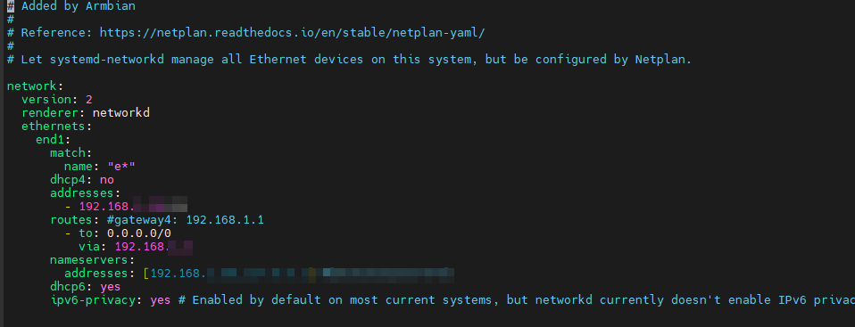
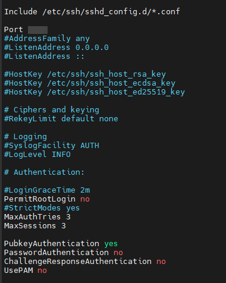

# 🟠 Primeros pasos 

## 💾 Instalación de Armbian

1. **Descarga de Armbian**  
   Ve a la [página oficial de Armbian](https://www.armbian.com/orangepi3b/) y descarga la imagen basada en Debian Bookworm para la Orange Pi 3B (v2.1).

   <div style="text-align: center;">
      
   </div> 


2. **Grabación de la imagen**  
   Utiliza una herramienta como Balena Etcher o Raspberry Pi Imager para grabar la imagen en una tarjeta microSD (recomendado mínimo 16GB, clase 10).

   <div style="text-align: center;">
      
   </div> 


3. **Primer arranque**  
   Inserta la microSD en la Orange Pi 3B y conéctala a la corriente. Espera a que el sistema arranque. El usuario por defecto suele ser `root` o `armbian`, consulta la documentación de Armbian para confirmar.

---

## 🌐 Configuración de IP fija

1. **Accede por consola o SSH**  
   Si tienes acceso a un monitor y teclado, inicia sesión localmente. Si no, conecta la Orange Pi a la red y busca la IP asignada por DHCP en tu router.

2. **Edita la configuración de red**  
   Abre el archivo de configuración de red con tu editor favorito, por ejemplo:

   ```sh
   sudo nano /etc/netplan/10-dhcp-all-interfaces.yaml
   ```

   Añade o edita el contenido para asignar una IP fija (ajusta la IP según tu red):

<div style="text-align: center;">
   
</div>   

   Guarda y cierra el archivo.

3. **Reinicia la interfaz de red**  

   ```sh
   sudo netplan apply
   ```

---

## 🔐 Configuración de SSH

1. **Cambiar el puerto SSH a 2222**  
   Edita el archivo de configuración SSH:

   ```sh
   sudo nano /etc/ssh/sshd_config
   ```

   Busca la línea:

   ```
   #Port 22
   ```

   Y cámbiala por ejemplo:

   ```
   Port 2222
   ```

2. **Deshabilitar acceso por contraseña**  
   En el mismo archivo `/etc/ssh/sshd_config`, busca y modifica (o añade si no existen) las siguientes líneas:

   ```
   PasswordAuthentication no
   ChallengeResponseAuthentication no
   UsePAM no
   ```

3. **Habilitar autenticación por clave pública**  
   Verifica que esta línea esté presente y sin comentar:

   ```
   PubkeyAuthentication yes
   ```

<div style="text-align: center;">
   
</div>   


4. **Copiar tu clave pública al Orange Pi**  
   Desde tu máquina cliente (donde tienes la clave privada), ejecuta:

   ```sh
   ssh-copy-id -p 2222 usuario@192.168.1.x
   ```

   Si `ssh-copy-id` no funciona por el puerto personalizado, puedes hacerlo manualmente:

   En tu máquina cliente:

   ```sh
   cat ~/.ssh/id_rsa.pub
   ```

   Copia la salida.

   En tu Orange Pi:

   ```sh
   mkdir -p ~/.ssh
   nano ~/.ssh/authorized_keys
   ```

   Pega la clave pública, guarda y cierra.

   Asegúrate de que los permisos sean correctos:

   ```sh
   chmod 700 ~/.ssh
   chmod 600 ~/.ssh/authorized_keys
   ```

5. **Reiniciar el servicio SSH para aplicar cambios**

   ```sh
   sudo systemctl restart ssh
   ```

6. **Probar la conexión**  
   Desde tu cliente, prueba:

   ```sh
   ssh -p 2222 usuario@192.168.1.x
   ```

   Debería pedir solo la clave y no la contraseña.

**Extra: Bloquear acceso SSH para root**  
En `/etc/ssh/sshd_config`:

```
PermitRootLogin no
```

---

✅ Con esto tenemos la Orange Pi 3B lista, con Armbian, IP fija y acceso remoto seguro por SSH.

💡 Ahora podremos empezar a configurarla desde nuestra oficina relajadamente sin tener que usar monitores ni periféricos de más 😉