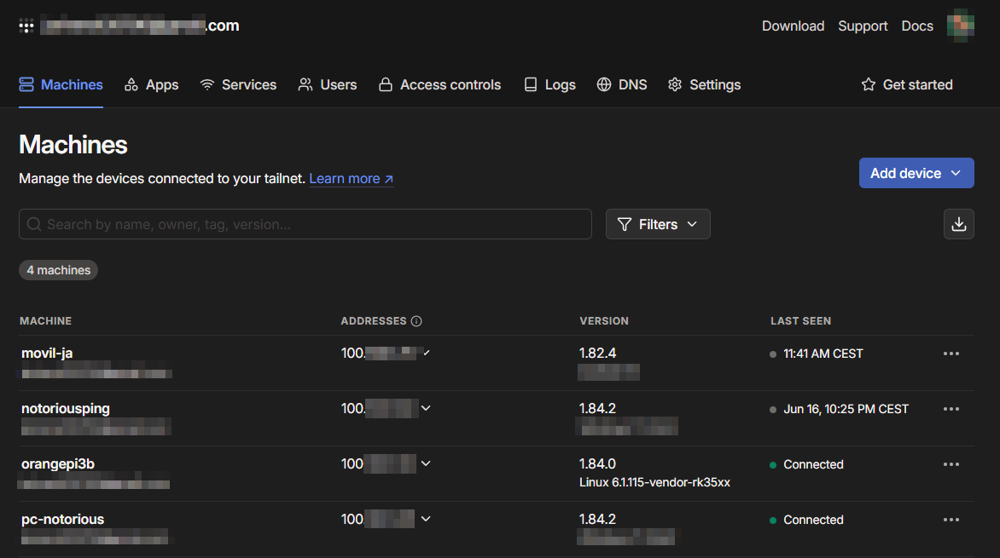

# Red Privada Virtual entre Viviendas

## 🎯 Objetivo

Interconectar dos viviendas a través de una red virtual privada, permitiendo que todos los dispositivos se comuniquen como si estuvieran en la misma red local, incluso estando detrás de CG-NAT, aprovechar esta función VPN para poder controlar de manera remota los sistemas.

---

## 🔐 Opciones de implementación


### 🧠 Opción 1: ZeroTier (Avanzada)

ZeroTier permite crear redes virtuales más flexibles y complejas, similar a una VPN con funciones tipo SD-WAN.

   

**Ventajas:**

- 🕸️ Control completo sobre la **topología de red**
- 🏗️ Ideal para redes mixtas o VLANs virtuales
- 🔗 Compatible con **bridge de red** y acceso entre subredes

#### 🧪 Instalación

Para su instalación, se usan los siguientes comandos:
```bash
curl -s https://install.zerotier.com | sudo bash
sudo zerotier-cli join <NETWORK_ID>
```

🔗 **Requiere configuración adicional en:** [my.zerotier.com](https://my.zerotier.com)

---

#### 📝 Notas

- Debemos autorizar manualmente cada nuevo dispositivo desde el panel web.
- Es necesario configurar reglas de red para definir los flujos de tráfico y accesos.

---
### ✅ Opción 2: Tailscale (Decantado por esta opción)

Tailscale utiliza el protocolo WireGuard y es ideal para entornos con CG-NAT (este caso) por su facilidad de configuración y mantenimiento. Para realizar este proyecto, acabé decantándome por esta opción, pues mis redes por necesidad no presentan complejidad (por ejemplo, no configuraremos Vlans, pues no es necesario para lo que se pretende).

   

**Ventajas:**

- 🚀 Funciona automáticamente tras CG-NAT
- ⚡ Instalación sencilla
- 🌐 MagicDNS y Subnet Routing
- 🔒 ACLs centralizadas desde la web

---

#### 🛠️ Pasos para instalar y usar Tailscale

##### 1️⃣ Instalación de Tailscale en Orange Pi (Armbian)

Para instalar Tailscale debemos primero descargar e instalar el paquete con:
```bash
curl -fsSL https://tailscale.com/install.sh | sh
```

---

##### 2️⃣ Iniciar y conectar Tailscale

A continuación:
```bash
sudo tailscale up
```
Este comando nos dará una URL para autenticarnos en nuestra cuenta de Tailscale.  
Abriremos esa URL en el navegador y haremos login con cualquierea de las opciónes.

---

##### 3️⃣ Verificar la conexión

Después de autenticarse, la Orange Pi tendrá una IP dentro de la red Tailscale, algo tipo `100.x.x.x`.

Lo podemos comprobarlo con:

```bash
tailscale ip -4
```

---

##### 4️⃣ Conectar desde otro dispositivo

- Ahora podemos instalar Tailscale en cualquier portátil, móvil o PC.
- Sólamente habría que hacerlo con la misma cuenta.
- Hecho esto ya se puede acceder al Orange Pi usando la IP Tailscale, por ejemplo:

```bash
ssh usuario@100.x.x.x -p 22
```
#### 🤖 Panel de Administración web de Tailscale

Podemos acceder al panel de administración a través de: [https://login.tailscale.com/admin/machines](https://login.tailscale.com/admin/machines)

   

---

#### 💡 Recomendaciones con Tailscale

- ✨ Activar **MagicDNS** para evitar usar IPs manualmente.
- 🛡️ Gestionar las reglas de acceso (ACLs) desde [https://login.tailscale.com/admin/machines](https://login.tailscale.com/admin/machines).
- 🌍 Utilizar `--advertise-routes` en caso de hacer **Subnet Routing** y exponer una red local completa.

---

## ⚖️ Comparativa rápida

| Característica        | Tailscale         | ZeroTier        |
|-----------------------|-------------------|-----------------|
| Soporte CG-NAT        | ✅ Sí             | ✅ Sí           |
| Facilidad de uso      | 🟢 Muy fácil      | 🟡 Media        |
| Control avanzado      | 🟡 Limitado       | 🟢 Avanzado     |
| Subnet Routing        | ✅ Sí             | ✅ Sí           |
| Interfaz de gestión   | Web sencilla      | Web avanzada    |
| Consumo de recursos   | Bajo              | Bajo            |

---

## 🔚 Consideraciones finales

- Si buscas algo simple y funcional rápidamente, **Tailscale** es la mejor opción.
- Si necesitas crear redes virtuales complejas entre múltiples ubicaciones o VLANs, considera usar **ZeroTier**.
- Ambas soluciones pueden coexistir para pruebas, pero lo mejor es **usar solo una en producción** para evitar conflictos de red.

